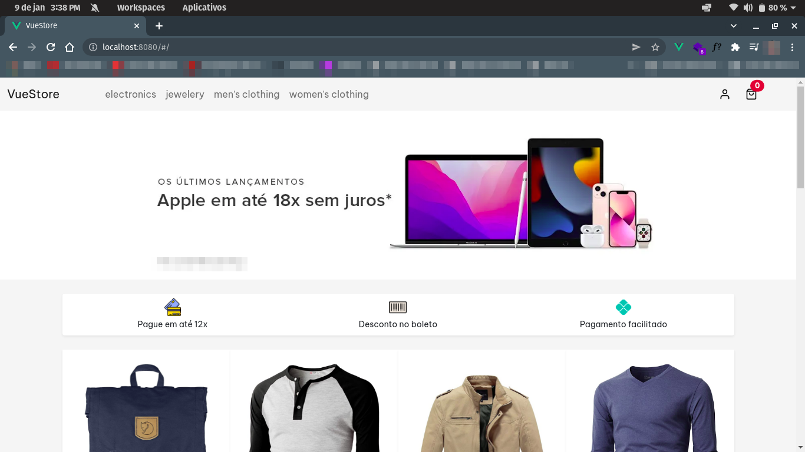

# VueStore (em desenvolvimento)

Aplicação para fins de prática de VueJS

# Conceitos colocados em prática
* VueRouter
* Componentização
* Mixins
* Consumo de APIs com Axios
* Manipulaçã de estado
* Comunicação entre componentes

# Bibliotecas e recursos

[vue-cookies](https://www.npmjs.com/package/vue-cookies)

[feathericons](https://feathericons.com)

[flaticon](https://www.flaticon.com)

[bootstrap](https://getbootstrap.com)

[vue-router](https://router.vuejs.org/)

# API utilizada

[fakestoreapi](https://fakestoreapi.com/docs)
